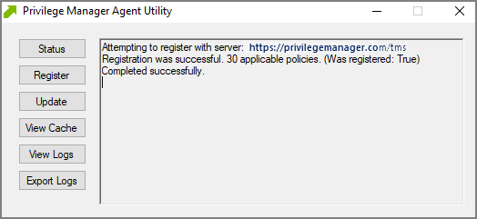
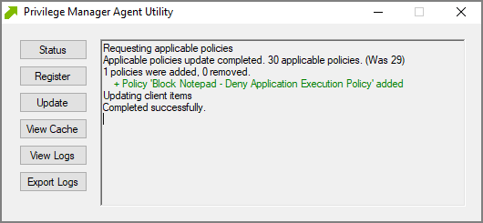
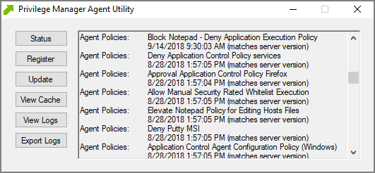

[title]: # (Endpoint Troubleshooting)
[tags]: # (agents)
[priority]: # (10001)
# Endpoint Troubleshooting

This topc is intended to assist users in troubleshooting issues (such as policies not yielding expected results) from an endpoint machine that has the Thycotic agent installed on it. 

## Agent Install Codes

Privilege Manager version 10.5 and above will require an installation code when installing the latest agent on an endpoint. This is a code for only one-time use and is removed from the endpoint after the agent is installed. More information regarding the agent install codes can be found at the link below:

https://thycotic.force.com/support/s/article/PM-Agent-Install-Codes

If it becomes necessary to set the install code after the agent is installed, an install code can be set using a PowerShell script that must be run as an Administrator. This script, along with other useful agent scripts, will be located in the _C:\Progam Files\Thycotic\Powershell\Arellia.Agent_ folder on any machine with the Thycotic agent installed and is called __SetAMSServer.ps1__. The script will request parameters, as follows:

* The first parameter the script will request is the URL of the server you wish to connect to; its value should be https://PrivilegeManagerURL/TMS/.
* The second parameter it will ask for is the install code.

## Agent Utility

Most endpoint troubleshooting will begin with the agent. There is an Agent Utility that is installed with the agent, used to troubleshoot issues from the endpoint. To open the utility, navigate to the _C:\Program Files\Thycotic\Agents\Agent_ folder on the endpoint, and run the __Agent Utility.exe__ application. That will launch the utility, and it will look like the screenshot below.

### Status Button

The Status button will check that the endpoint can communicate with the server and will show you helpful information (such as the Agent ID and how many policies the machine has) and will validate the client items cache. It is also helpful in determining if there are any communication issues between the endpoint and the web server. Below is a screenshot of the information shown after clicking on the Status button.

### Register Button

The Register button will attempt to register the agent machine with the web console. It will show you the URL that the machine is using to communicate with the console. It will also give errors if there are issues with that communication. If you have just installed an agent on the machine, then it will also give information about the install code if there are any errors with that.

### Update Button

The Update button will communicate back to the web server and update any new applicable policies or changes to current policies, filters, actions, etc. the endpoint already has on it.

### View Cache Button

The View Cache button will show you the Policies, Filters, and Actions the endpoint currently has.

### View Logs

Clicking on the View Logs button will open the Agent Log Viewer in a separate window. The screenshot below shows what the log viewer looks like. 

### Export Logs Button

Clicking on the Export Logs button will allow you to save the agent logs so that you can send them to someone if needed. They will be saved in the .evtx format so they can be opened with Event Viewer in Windows. Anytime there are issues with policies on endpoints and you need additional assistance, you will need to collect the agent logs first to help with determining what is causing the issue.

## Policy Troubleshooting

If there is an issue with policies not getting updated on the endpoint, or specific files or applications not being elevated or blocked, please use the information below to help determine what is causing the issue.

### Policies Not Getting Updated

If policies are not getting updated on the endpoint, there could be a communication issue between the machine that has the agent installed on it and the web server. The best way to determine if there is a communication issue would be to open the Agent Utility on the endpoint as described in the previous section, and then do the following:

1. Click on the Status button and see if there are any errors shown.
2. Click on the Register button and check for errors shown there.
3. Click on the Update button and check for errors there as well.

If there is an issue with the endpoint communicating with the web server, there will be errors displayed in red after clicking on those buttons.

### Specific Files or Applications Not Being Elevated or Blocked

If specific files or applications are not being elevated or blocked properly, then you will need to look in the Agent Logs on the endpoint. You can open the logs by first opening the Agent Utility on the machine. Once that is open, click on the View Logs button to bring up the Agent Log Viewer.

The Agent Log Viewer is very helpful for troubleshooting issues with policies not applying correctly. In the log, you can see if a policy applied to a certain process, and if so, what policy applied to that process. You can also see if there was no policy that applied to that specific process.

For example, in the screenshot below of the Agent Log Viewer, you will see a policy called “Block Notepad - Deny Application Execution Policy” that has been applied to the endpoint.

The highlighted entry on the screenshot above shows that the “Block Notepad - Deny Application Execution Policy” was triggered when notepad was opened. Double-click on the log entry to see further details as shown below. This shows the exact process that met the criteria of the policy and shows the priority number of that policy. The policy priority is useful information if the application continues processing through multiple policies.

With this information, you know that the policy applied to the Notepad process correctly. If there were other policies that applied to that same process, you would see them in the log viewer as well. There are certain situations in which clients will apply multiple policies to the same process. When troubleshooting issues with certain files or applications, the log viewer is a valuable tool to use.

If there is no policy that applies to a certain process, the Agent Log Viewer shows you that as well. In the screenshot of the log viewer, presented above in this section, you can notice entries showing that there are some processes to which no policies apply.. Entries that begin with “No policies applies to process...” indicate that no policy was triggered when the application executed on the endpoint. If a client says that a specific file or application is not being blocked or elevated, then in the log viewer you can see what process is running when they launch the application and whether a policy is applying to that process.

If there are any Errors in the log viewer, they are shown in __Red__. Warnings are shown in __Blue__, and Informational messages are shown in Black.